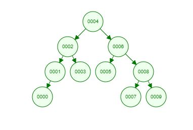

## Veri Yapıları ve Algoritmalar - Bölüm Sonu Projeler - Proje-3 - Binary Search Tree Projesi

Merhaba, patika.dev front-end başlangıç eğitimi Veri Yapıları ve Algoritmalar bölüm sonu projeleri ödevini yaptım. 

---------------------------------

SORU 1: [7, 5, 1, 8, 3, 6, 0, 9, 4, 2] dizisinin Binary-Search-Tree aşamalarını yazınız. 

Örnek: root x'dir. root'un sağından y bulunur. Solunda z bulunur vb. 

ÇÖZÜM 1:  

>> Root 4 olacak şekilde resimdeki gibi binary search tree oluşturulabilir.

patika.dev profilime aşağıdaki linkten ulaşabilirsiniz.
------------------------------------------------------

[www.patika.dev linkim](https://app.patika.dev/tunadev) 